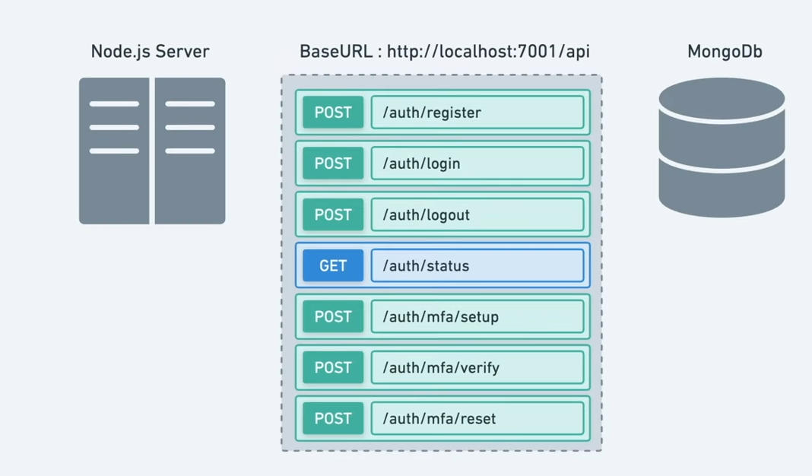

# Two-Factor Authentication (2FA) / Multi-Factor Authentication (MFA) Project

This project implements a complete 2FA/MFA solution with a React frontend and Node.js/Express backend.



## Project Structure

```
.
├── Backend/
│   ├── package.json
│   ├── .env
│   └── [Other backend files]
└── Frontend/
    ├── package.json
    └── [Other frontend files]
```

## Technologies Used

### Backend
- **Node.js** with ES Modules
- **Express.js** v5 - Web framework
- **MongoDB/Mongoose** - Database
- **Speakeasy** - Two-factor authentication library
- **QRCode** - QR code generation for 2FA setup
- **Passport.js** - Authentication middleware
- **JWT** - JSON Web Tokens for session management
- **Bcrypt.js** - Password hashing

### Frontend
- **React** v19 - Frontend library
- **Vite** - Build tool and development server
- **ESLint** - Code linting

## Features

- User registration and login
- Two-Factor Authentication (2FA) using Time-Based One-Time Password (TOTP)
- QR code generation for easy 2FA app setup (Google Authenticator, Authy, etc.)
- Secure token-based authentication
- MongoDB integration for user data storage

## Prerequisites

- Node.js (v14 or higher)
- MongoDB database (local or cloud instance)
- npm or yarn package manager

## Setup Instructions

### Backend Setup

1. Navigate to the backend directory:
   ```bash
   cd Backend
   ```

2. Install dependencies:
   ```bash
   npm install
   ```

3. Create a `.env` file with the following variables:
   ```env
   CONNECTION_STRING=mongodb://localhost:27017/twofa
   SESSION_SECRET=your_strong_session_secret_here
   ```

4. Start the server:
   ```bash
   npm start
   ```
   
   The backend server will run on port 9000.

### Frontend Setup

1. Navigate to the frontend directory:
   ```bash
   cd Frontend
   ```

2. Install dependencies:
   ```bash
   npm install
   ```

3. Start the development server:
   ```bash
   npm run dev
   ```
   
   The frontend development server will run on port 3000.

## API Endpoints

### Authentication Routes (`/api/auth`)

- `POST /api/auth/register` - User registration
- `POST /api/auth/login` - User login (with Passport.js local strategy)
- `GET /api/auth/authstatus` - Check authentication status
- `GET /api/auth/logout` - User logout

### 2FA Routes (`/api/auth/2fa`)

- `POST /api/auth/2fa/setup` - Initiate 2FA setup
- `POST /api/auth/2fa/verify` - Verify 2FA token
- `POST /api/auth/2fa/reset` - Reset 2FA for user

## Usage

1. Register a new user account using the `/api/auth/register` endpoint
2. Log in with your credentials using the `/api/auth/login` endpoint
3. Set up 2FA by making a request to `/api/auth/2fa/setup` to generate a QR code
4. Scan the QR code with your authenticator app (Google Authenticator, Authy, etc.)
5. Verify the 2FA setup by sending the generated code to `/api/auth/2fa/verify`
6. On subsequent logins, you'll need to provide both password and 2FA code

## Security Considerations

- All passwords are hashed using bcrypt
- Session management using express-session and passport.js
- 2FA secrets are stored securely in the database
- CORS is enabled for controlled cross-origin requests

## Contributing

1. Fork the repository
2. Create a feature branch
3. Commit your changes
4. Push to the branch
5. Open a pull request

## License

This project is licensed under the MIT License.